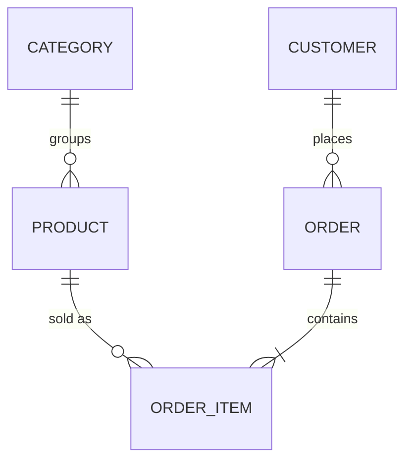

# ERD.md: the data, agreed before the schema is written

The database agent writes the schema, the backend reads it, and the
frontend shows it. When nobody fixed the model first, the backend queries
`user_id` while the migration made `customer_id`, money is a float in one
place and cents in another, and the one query the catalogue runs on every
visit has no index. This document is where the entities, their fields and
their relations are decided once, from the requirements.

## 1. The template

````markdown
# Data model

Database: Postgres 16. Conventions: snake_case; ids uuid (v7) unless noted;
created_at / updated_at timestamptz on every table; money as integer minor
units with a currency code.



## product
| Field | Type | Null | Default | Notes |
|---|---|---|---|---|
| id | uuid | no | uuid v7 | primary key |
| category_id | uuid | no | | → category.id, on delete restrict |
| slug | text | no | | unique; used in URLs |
| name | text | no | | |
| price_minor | integer | no | | ≥ 0 |
| currency | char(3) | no | 'IDR' | ISO 4217 |
| stock | integer | no | 0 | ≥ 0 |
| archived_at | timestamptz | yes | | set instead of deleting |

Indexes: (category_id, created_at desc) for the catalogue page; unique (slug).

## Relationships
- A category has many products; a product has one category (required).
- An order has one or more items; an item copies the product's name and price at the time of sale.

## Rules
- Products are archived, not deleted: past orders keep pointing at them.
- Order items keep price_minor and name as sold; changing a product never changes a past order.

## Migrations (order)
1. category 2. product 3. customer 4. order 5. order_item
## Seed
- 6 categories, 24 products: placeholders, listed in db/seed.ts.
````

## 2. From requirements to entities

- Read `PRD.md` and `DESIGN.md`: every noun a user creates, sees in a
  list, or refers to later is a candidate entity (product, order,
  booking). Every adjective that filters a list is a field or a relation
  (category, status, date).
- Keep the first version's model to what the Must requirements need. A
  field "for later" is a migration later.
- Name things as the user does, in English, singular table names or the
  project's existing convention; the same name then appears in `API.md`
  and the types.

## 3. Fields

- **Types that fit**: `text` for strings unless a limit is a rule;
  `integer` minor units for money, never floats; `timestamptz` for moments,
  `date` for calendar days; `boolean` only for real two-state facts (a
  status with a future third value is an enum or text with a check).
- **Null means unknown or not applicable**, decided per field. Required
  fields are `not null` with a default only when there is a true default.
- **Constraints carry the rules**: unique, check (`price_minor >= 0`),
  foreign keys with an explicit on-delete (restrict, cascade for owned
  children, set null for optional links).
- **Enums** as text with a check, or the database's enum type when the
  project uses them; list the values.

## 4. Relationships and keys

- Cardinality in words and in the diagram (`||--o{` one to zero or many,
  `||--|{` one to one or many, `}o--o{` many to many through a join
  table).
- Many-to-many always gets its own table with both keys and anything that
  belongs to the link (a quantity, a role, a date).
- Keys: uuid (v7 sorts by time) or bigint identity; slugs or codes for
  public URLs, never the internal id when guessing it would expose data.
- Multi-tenant data carries the tenant key on every table that needs
  isolation, and every index starts with it.

## 5. Indexes from the queries

List the queries the screens run (from `DESIGN.md`'s screens and the API
routes) and give each an index that serves it: filter columns first, then
the sort. No index without a query that needs it.

## 6. History and deletion

Say, per entity, whether rows are deleted, archived (`archived_at`) or
never removed, and what a record copies at the moment it is made (an order
item's price). Personal data: what is stored, why, and how a user's data
is removed when they ask.

## 7. The Mermaid diagram

Entity names in capitals, relationship labels in quotes when they have
spaces, one line per relation. Keep attributes in the tables below the
diagram rather than in it: the tables are what the database agent reads.

## Check it

- Every entity traces to a requirement; every Must requirement's data has
  a home.
- Money, dates and ids follow `ARCHITECTURE.md`'s conventions.
- Every foreign key has an on-delete; every list the screens show has an
  index.
- The names match `API.md` and the shared types.

## Avoid

Floats for money; nullable everything; many-to-many without a join table;
indexes on every column; fields "for later"; deleting rows that other
records point at; a diagram that disagrees with the tables.
