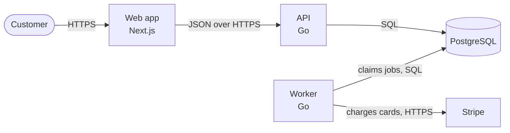
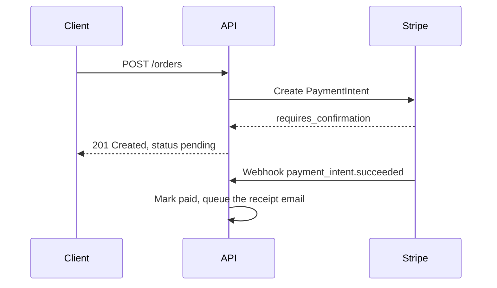

# Design docs, decisions, diagrams and runbooks

The generated version: a design doc that describes the implementation
already written and weighs no alternative; an architecture diagram of
boxes labelled "Service" joined by unlabelled arrows, drawn once in a tool
nobody else can edit; decisions that live in a chat thread nobody can
find; a runbook that says "check the logs". This skill: design docs
reviewed before building, decision records for choices that are costly to
reverse, diagrams kept as text at the levels that help, a map of the code
for new engineers, and runbooks that someone woken at night can follow.

## 1. Which document

| Question | Document | Size |
|---|---|---|
| Should we build it this way? | Design doc | 1 to 3 pages for most work; more only for a large system |
| What did we decide, and why? | Architecture decision record (ADR) | One page |
| How is this system put together? | System overview, `ARCHITECTURE.md` | A few screens |
| What do I do when this alert fires? | Runbook | One page per alert or operation |
| What does this word mean here? | Glossary | A table |

- A design doc comes before building anything that takes more than about
  a week, crosses teams, or changes a data model or a public interface.
- An ADR records any decision that is costly to reverse or that people
  will ask about later. A design doc usually yields one or more.

## 2. Design docs

Their value is the review before building. Write for a reviewer with
twenty minutes, and keep it short.

```markdown
# Cursor pagination for the orders API

Status: In review
Author: <name>
Reviewers: <names>
Date: 2026-09-29

## Context
What exists, what is wrong or missing, and the evidence: incidents,
tickets, measurements. Real ones only.

## Goals
- Measurable where possible.

## Non-goals
- What a reader might expect this to do that it deliberately does not.

## Proposal
Components and their jobs, data model changes, interfaces (signatures,
endpoints), the data flow as a diagram, failure modes, security and
privacy, observability, cost and performance, each estimate with its basis.

## Alternatives considered
Each option, and why not. Doing nothing is one of them.

## Risks and open questions
Each with an owner.

## Rollout
Phases, flags, backfills, compatibility, how to roll back, how success is
measured.
```

- The status moves through draft, in review, approved, then implemented
  or abandoned. Decisions reached in review are written into the doc, not
  left in its comments.
- After building, set the status and link the pull requests. The doc is
  not rewritten to match what was built; what changed along the way goes
  into an ADR.

## 3. Architecture decision records

- The Nygard form: a title stating the decision; a status (Proposed,
  Accepted, Deprecated, or Superseded by ADR-0012); the context (the forces
  at play, stated neutrally); the decision ("We will ..."); and the
  consequences, good and bad: what becomes easier and what becomes harder.
- MADR adds the options considered, with pros and cons, when options need
  comparing side by side.
- One file per decision, numbered and never renumbered:
  `docs/adr/0007-use-postgresql-for-the-job-queue.md`, with an index in
  `docs/adr/README.md`. adr-tools defaults to `doc/adr`; keep whatever the
  repository already has.
- Accepted records are not edited. A changed decision is a new ADR that
  supersedes the old one, whose status line alone is updated.
- Write one for: the database, the framework, a protocol, the
  authentication or tenancy model, the shape of a public API, how the
  system is built and deployed, a deliberate break from common practice.
  Not for a library upgrade, or a choice one pull request can undo.
- Write it at decision time. Recording an old decision is still worth it:
  give both the date decided and the date written.

```markdown
# 7. Use PostgreSQL for the job queue

Date: 2026-09-29
Status: Accepted

## Context

Jobs are created in the same transaction as the rows they act on, such as
an order and its confirmation email. With the Redis queue, a crash between
the commit and the enqueue loses the job; this happened in #301 and #344.
PostgreSQL 16 already runs in every environment.

## Decision

We will store jobs in PostgreSQL and claim them with
`SELECT ... FOR UPDATE SKIP LOCKED`.

## Consequences

- A job exists if and only if its data was committed.
- Redis stays, for caching only.
- Job throughput is bounded by the database; if that becomes the limit, a
  new ADR revisits this one.
- The jobs table needs vacuum settings of its own (see its runbook).
```

## 4. Diagrams as code

- Diagrams are text in the repository, reviewed in pull requests and
  rendered where they are read: Mermaid renders on GitHub, on GitLab and in
  most documentation generators. Structurizr DSL, PlantUML or D2 where the
  project already uses them. A drawing from a visual tool (Excalidraw,
  draw.io) is committed with its source (`.excalidraw`, `.drawio`, or an
  export with the source embedded), never as a lone PNG.
- The C4 levels: **Context** (the system, the people who use it, the
  external systems it talks to), **Container** (the deployable parts:
  applications, services, databases, queues), **Component** (the parts
  inside one container), **Code** (rarely drawn: the code is that
  diagram). Most systems need Context and Container; draw Component only
  for a container that is hard to follow.
- Every box says what it is, its technology and its job. Every arrow is
  labelled with what flows and how ("Sends invoices, HTTPS and JSON") and
  points one way. A legend when a shape or colour means something.
- Sequence diagrams for flows that cross parts (sign-in, checkout, a
  webhook), especially their asynchronous steps and failure paths.
- One diagram answers one question, with 5 to 15 boxes; split past that.
- Generate what can be generated, so it cannot drift: database diagrams
  from the schema (tbls, SchemaSpy), dependency graphs from the build.





Mermaid also has C4 diagram types (`C4Context`, `C4Container`), still
marked experimental; the flowchart form renders wherever Mermaid does.

## 5. The system overview

`ARCHITECTURE.md` at the root (or `docs/architecture.md`), for an engineer
in their first week. Short, and only what changes rarely, so it is
revisited a few times a year rather than with every commit.

- What the system does, in a paragraph, and a Container diagram.
- The codemap: each top-level directory, package or crate, and what lives
  there. Name the important modules and types so they can be searched
  for; links to lines go stale.
- How a typical request or job moves through the parts.
- Invariants, often stated as something absent: "the domain package
  imports nothing from the HTTP package", "only `db/` writes SQL".
- The boundaries between layers, and the cross-cutting concerns: errors,
  logging, configuration, authentication, testing.
- Where to start for common changes: "a new endpoint starts in
  `api/routes.go`".
- How to run it belongs in the README or `CONTRIBUTING.md`: link it.

## 6. Runbooks

One page per alert or risky operation, for someone under pressure:

```markdown
# OrdersQueueBacklog

Last verified: 2026-09-29, by <name>

## What it means
Jobs wait more than 5 minutes; order confirmation emails are late.

## Check
1. The queue dashboard: <link>. Normal is under 100 waiting jobs.
2. The workers are running: `kubectl get pods -n orders -l app=worker`
3. The oldest failing job: <copyable query>

## Act
1. If workers are crashing, roll back their last deploy: <command>
2. If one job type keeps failing, pause it: <command>. The rest continue.
3. If the backlog still grows after 15 minutes, escalate.

## Escalate
The orders on-call rotation: <link>. Payments on-call if charges fail.
```

- The title is the alert's exact name, and the alert links to the page
  (`runbook_url` in a Prometheus alert's annotations, or your alerting
  tool's field for it).
- Checks before actions, read-only commands first; every command
  copyable and taken from a real session; destructive steps marked, with
  their confirmation.
- Decision points written out ("if this, go to step 4"), and how to undo
  each action that changes something.
- Secrets referenced by their path in the secret manager, never pasted.
- A last-verified date, renewed by running the runbook in a drill, not by
  reading it. The alerts themselves are in `backend-observability`.

## 7. Glossary and links from code

- A glossary for the terms the team uses its own way: the term, its
  meaning, its name in code. "Account: a paying organisation (`Tenant` in
  code), not a person's login."
- Code that surprises links to the decision behind it:
  `// Enqueued in the order's transaction: docs/adr/0007-use-postgresql-for-the-job-queue.md`.
- Decisions stay findable: a `docs/` index lists the design docs and ADRs
  with their status, and the README links to it.

## Check it

- A design doc has goals and non-goals, at least one real alternative
  with why not, a rollout with a rollback, and open questions with owners.
- An ADR is numbered, has a status, states the forces in its context, the
  decision as "We will ...", and costs among its consequences.
- Diagrams render (in the docs build or a Markdown preview), every arrow
  is labelled, none has more than about 15 boxes, and the source is
  committed.
- Every directory in the codemap exists (`glob`) and every module or type
  it names exists (`grep`).
- Every runbook command comes from a working session or is marked as not
  run; dashboards are linked; the last-verified date is real.

## Avoid

Design docs written after the code; no alternatives or no non-goals;
unlabelled arrows and boxes named "Service"; diagrams as images without
their source; ADRs edited after acceptance; decisions left in chat; an
overview that lists files without saying how they fit together; runbooks
that say "check the logs"; secrets in a runbook; invented incidents or
metrics as context.
